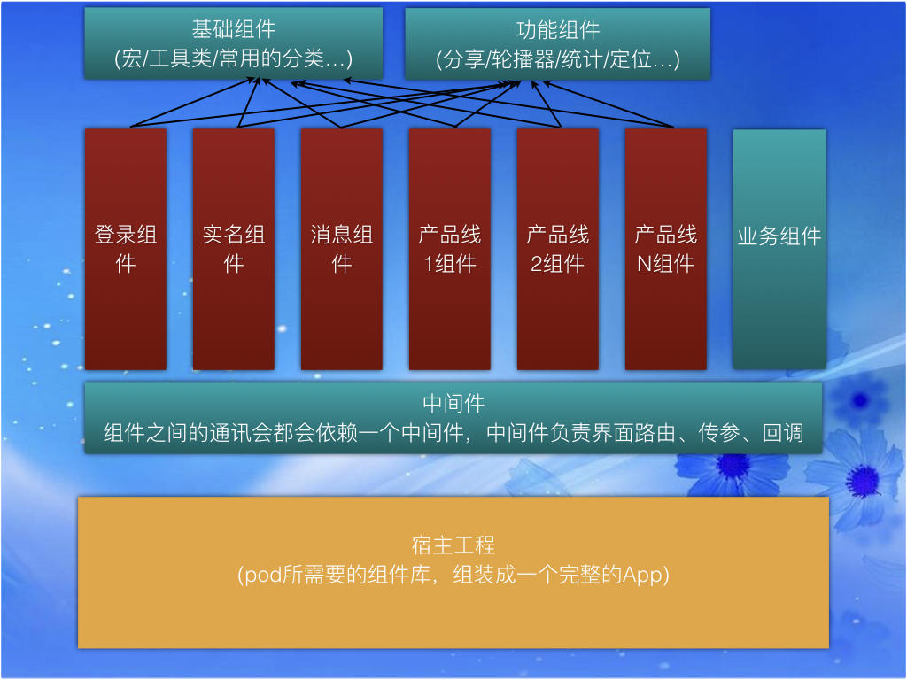

---
title: 关于组件化
date: 2018-11-10 17:19:55
tags: target-action + runtime
---

# Bion组件化

## 背景
** 项目存在的问题**
> 1.项目代码没有结构，引用杂乱，横向依赖，耦合性高
> 2.代码无规范，易读性很差
> 3.不易扩展以后的业务开发

一.组件化解决问题，
**步骤**
## 1.项目逐步拆分
这里说的分割项目是，分两个纬度，第一个纬度是垂直的分层，也是项目依赖分层，主要是把项目的公共组件，speedy库，vender库，pod库建立合理的基筑
横向拓展分模块 __BussinessA__  __BussinessB__

> 基础模块
依赖一些稳定版本的三方，不参与业务的定制化，区分基础模块的概念是该模块稳定性，能在其他项目中使用 类似speedy 这种 存在很多的systemCategory__common文件__这个是初期最为方便的高复用，便捷的东西，但是从长远考虑它会越来越臃肿成为毒瘤，建议去除把重要的方法拆分出去

> 功能组件
供上层业务使用，可以有自己的独立性，有自己私有的(model, view，controller)，也可以是为了某些多处，高频率出现的单层工具（manager）
这些轮子或者公共UI组件都是只是垂直依赖基础模块，不能出现横向依赖
增加这些轮子是为了以后的业务扩展使用的

> 上层业务层(Business)
上层业务，是展现层，是需要快速迭代的，类比项目里面的UGC播放模块，榜单模块等** 这些模块势必出现的相互跳转，相互依赖，跨越调用的问题**
把功能集中的模块初步拆分出来，物理隔离，实现方式pod私有化，以project方式存在

 CocoaPods远程私有库: 每个拆分出去的组件存在的形式都是以Pod的形式存在的，并能达到单独运行成功。

宿主工程: 宿主工程就是一个壳，在组件库中寻找这个工程所需要的组件，然后拿过来组装成一个App。
  

## 2.实现方式
> 使用路由(mediator)，
可以理解成中间键，横向跨越调用可以是业务模块，也可以是功能模块
例子，规范定义每个组件的api,使用iOS里面的category(非正式协议)
各自模块的api自己维护，遵守规范 talk is cheaper show me code
> 去除依赖注入，实现解耦，所有的Module之间调用

> 实现方式：target+action  runtime消息转发

**NAMediator**
@interface NAMediator : NSObject

+ (instancetype)shareInstance;

/**
 本地组件的调用方法

 @param targetName 调用者
 @param actionName 响应action
 @param params 参数
 @param shouldCacheTarget 是否缓存target
 @return id范型返回
 */
- (id)performTarget:(NSString *)targetName action:(NSString *)actionName params:(NSDictionary *)params shouldCacheTarget:(BOOL)shouldCacheTarget;

 
/**
 远程App调用入口
 
 1.规则
 ------- scheme://[target]/[action]?[params]
 2.eg
 ------- Bion://target_UGC/playUGC?{ugcId=1234,userId=23444}
 
 @param url 规范url
 @param completion 回调
 @return id范型返回
 */
- (id)performActionWithUrl:(NSURL *)url completion:(void(^)(NSDictionary *info))completion;

/**
 根据targetName清除对应缓存

 @param targetName 调用者名
 */
- (void)releaseCachedTargetWithTargetName:(NSString *)targetName;

**ModuleA**

@interface NAMediator (ModuleA_Api)
//获取A控制器
- (UIViewController *)ModuleA_AViewController;
//打招呼功能
- (NSString *)ModuleA_sayHelloWithPersonName:(NSString *)personName;

#import "NAMediator+ModuleA_Api.h"

NSString *const kNAMediatorTargetA = @"A";

NSString *const kNAMediatorActionFetchAViewController = @"fetchAViewController";
NSString *const kNAMediatorActionSayHello = @"sayHelloWith";

@implementation NAMediator (ModuleA_Api)

- (UIViewController *)ModuleA_AViewController{
    UIViewController *vc = [self performTarget:kNAMediatorTargetA action:kNAMediatorActionFetchAViewController params:@{@"name":@"AViewController"} shouldCacheTarget:NO];
    if ([vc isKindOfClass:[UIViewController class]]) {
        return vc;
    }else{
        //这里要做异常处理
        return [UIViewController new];
    }
}

- (NSString *)ModuleA_sayHelloWithPersonName:(NSString *)personName{
    NSString *result = [self performTarget:kNAMediatorTargetA action:kNAMediatorActionSayHello params:@{@"name":personName} shouldCacheTarget:NO];
    if ([result isKindOfClass:[NSString class]]) {
        return result;
    }else{
        return @"返回错误";
    }
}

@end

**Target_A**

@interface Target_A : NSObject

- (UIViewController *)Action_fetchAViewController:(NSDictionary *)param;
- (NSString *)Action_sayHelloWith:(NSDictionary *)param;

@end

#import "Target_A.h"
#import "AViewController.h"

@implementation Target_A

- (UIViewController *)Action_fetchAViewController:(NSDictionary *)param{
    return  [[AViewController alloc] initWithName:param[@"name"]];
}

- (NSString *)Action_sayHelloWith:(NSDictionary *)param{
    return [NSString stringWithFormat:@"%@你好",param[@"name"]];
}
@end

**总结 **
这里的每个模块都需要暴露其他模块调用的api，可以提前定义在api(路由分类文件里面)，Target_A_可以后续是实现对应的方法，target依赖模块，module_api
不会依赖module ,以上这些是实现路由的调用思路，

## 3.去model化方案

> 1.为什么去model化，
首先model一般是从接口调用 json 映射 model 的，在此优点很明确，就是语义化，能getter方法，类型验证，但是缺点也很明显，内容嵌套的消耗就比较高了，基本不能复用，每一种类型的请求都会有一个 model 做基础单元,调试打印的时候不实现 description 方法不方便打印，

现状是项目里面的 model 太多了， 无论胖model和瘦model,在每个模块里面是依赖引用，当A模块和B模块之间使用model消息传递，通信的时候，就会产生相互依赖，model变的不可修改，只能增加属性，多模块依赖同一个 model 的情况很多，

> 2怎样去Model
以下是去model的实现思路

1.离散型api接口封装，每一种类型的接口是一个apiManager类 ，每一次请求都是一个apiManager的实例

2.构建一个数据过滤类reformer，实例化 reformer ，reformer是一个符合ReformerProtocol的对象，它提供了通用的方法供Manager使用。

3.api的原始数据（JSON对象）由Manager实例保管，reformer方法里面取Manager的原始数据(manager.jsonData)做过滤或者转换，然后交付出去。

**类比莲蓬头的水管部分是Manager，负责提供原始水流（数据流），reformer就是不同的模式，换什么reformer就能出来什么水流**

同一个reformer可以适用与不同的apiManager这时候就可以通过同一个reformer来做数据的标准化输出，这样就使得view + reformer 代码复用成为可能

同一个apiManager被多个view使用时，view不同的使用不同的reformer可以展示不同的数据，例如都是榜单首页数据，一个要展示列表view,一个要展示轮播图view，这时候就可以一个apiManager对应两个reformer

_reformer本质上就是一个符合某个protocol的对象，在controller需要从api manager中获得数据的时候，顺便把reformer传进去，于是就能获得经过reformer重新洗过的数据，然后就可以直接使用了。_

_reformer事实上是把转化的代码封装之后再从主体业务中拆分了出来，拆分出来之后不光降低了原有业务的复杂度，更重要的是，它提高了数据交付的灵活性。另外，由于Controller负责调度Manager和View，因此它是知道Manager和View之间的关系的，Controller知道了这个关系之后，就有了充要条件来为不同的View选择不同的Reformer，并用这个Reformer去改造Mananger的数据，然后ViewController获得了经过reformer处理过的数据之后，就可以直接交付给view去使用。Controller因此得到瘦身，负责业务数据转化的这部分代码也不用写在Controller里面，提高了可维护性。_

---- 首先保证在组件之间通过路由方式调用的参数传递要使用Dictionary json NSString UIImage 这些基本通用参数，在某个Module里面的内部使用的model可以继续使用，后续在逐步进行去Model化

## 4.在去model后怎样保持数据的可读性

使用常量字符定义文件语义化标记key 在需要使用的地方(一般是在cell赋值的地方)类比 model 属性的使用方式 

PropertyListReformerKeys.h

extern NSString * const kPropertyListDataKeyID;
extern NSString * const kPropertyListDataKeyName;
extern NSString * const kPropertyListDataKeyTitle;
extern NSString * const kPropertyListDataKeyImage;

PropertListCell.m

#import "PropertyListReformerKeys.h"

- (void)configWithData:(NSDictionary *)data
{
    self.imageView.image = data[kPropertyListDataKeyImage];
    self.idLabel.text = data[kPropertyListDataKeyID];
    self.nameLabel.text = data[kPropertyListDataKeyName];
    self.titleLabel.text = data[kPropertyListDataKeyTitle];
}

